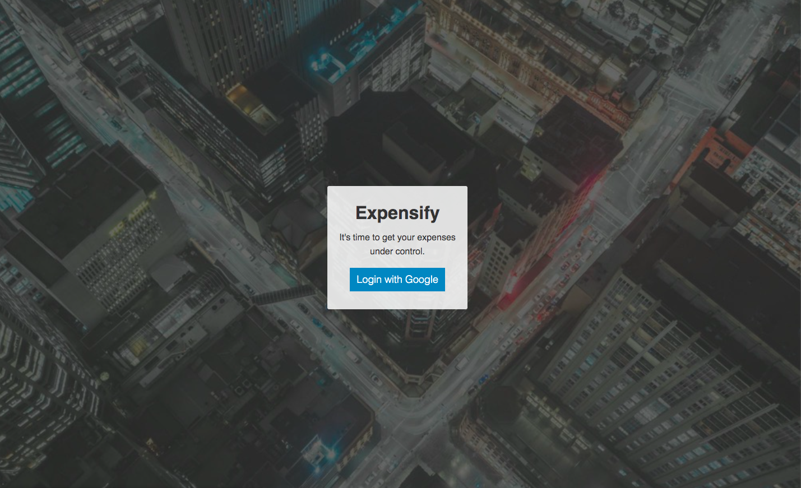
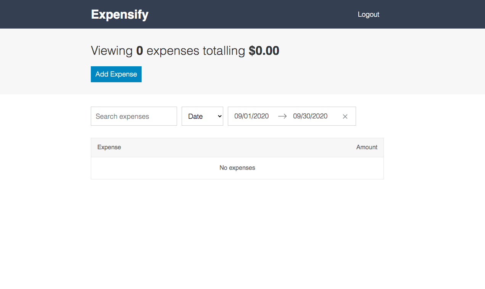
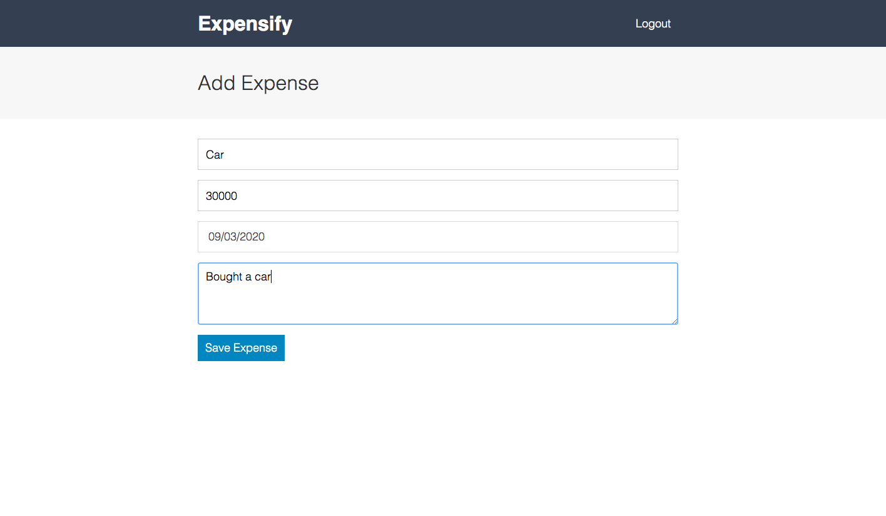
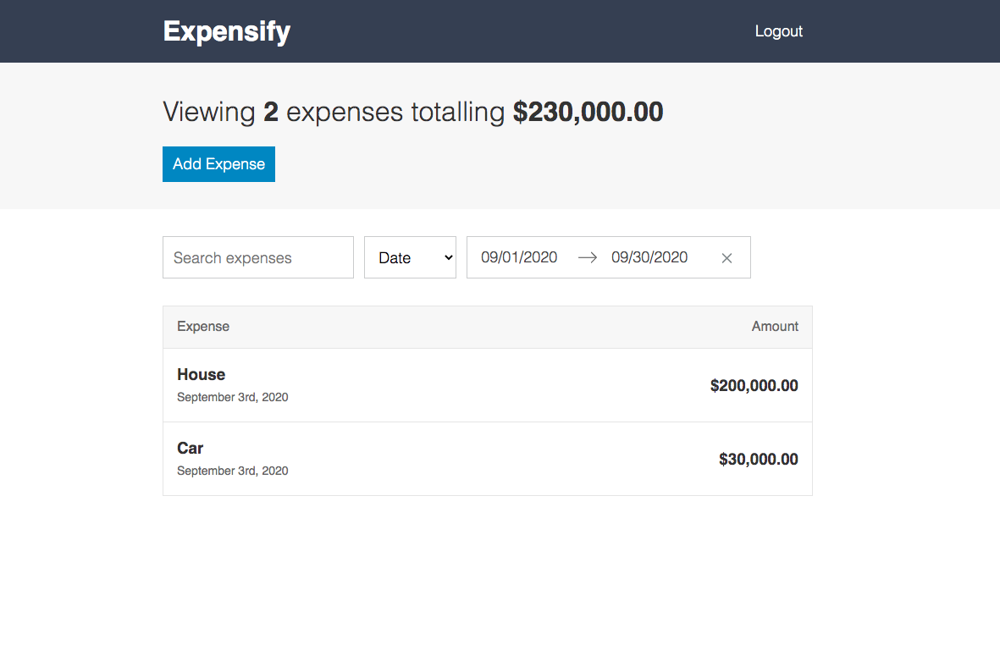
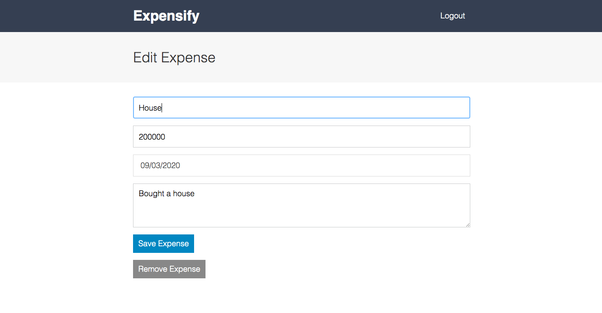
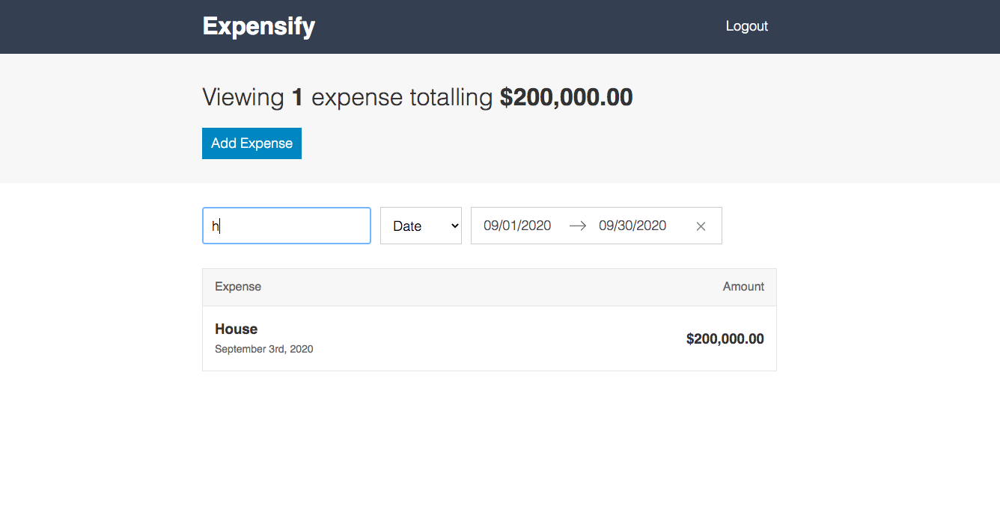
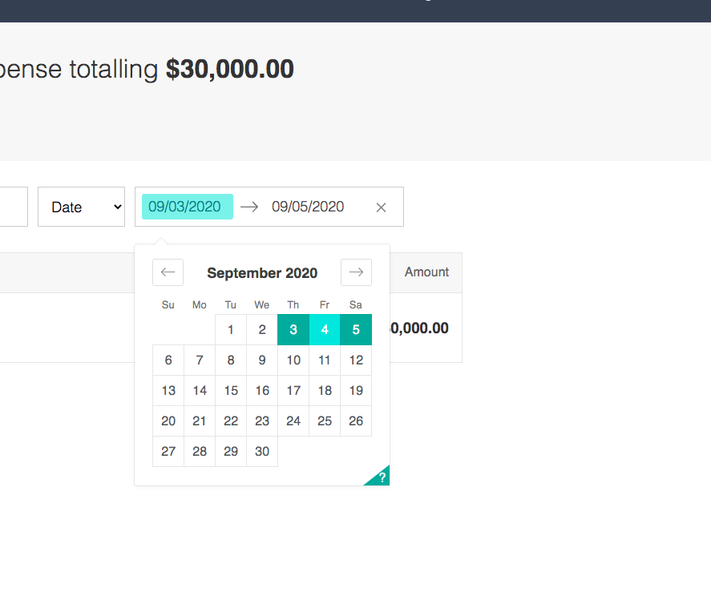

# Expensify

A React based application that allows the user to add expenses, filter through expenses,  edit expenses, look expenses by date, and remove expenses. Dates are tracked for each expense saved. 

## Application description:

 A React based application that allows the user to add expenses, filter through expenses,  edit expenses, look expenses by date, and remove expenses. Dates are tracked for each expense saved. 
 

 ## Click [here](https://expensifyyyyyy.herokuapp.com/) for the live app. 
 
 A Authentication page will pop up  for the user to login with google:
 
 
 This is the home screen:
 
 
 
 The user will then click the add expense button and will be directed to the add expense page:
 

The expenses will then appear on the home screen:

 
  
 The user can then click on the expenses and then be direced to the edit expense page where they can edit or remove the expense::
 

The user can also sort through expenses by typing in the search bar:  

     
  
  The user can also sort through expenses baded off the date the expense was made:
  
  
    
  
  The user can the click the logout button on the home page and be redirected to the authentication npage:
  
  
 
 
## Libraries and Frameworks:

- React
- Moment
- Express
- Firebase
- History
 - Node-SASS
 - Normalize.CSS
 -React-Dom
 -React-Scripts
 -Numeral
 -React-Modol
 -React-Redux
 -React-Router-Dom
 -Redux
 -Redux-Mock-Store
 -Redux-Thunk
 -Sass-Loader
 -Style-Loader
 -UUID
 -Validator
 - React-Addons-Shallow-Compared
 - CSS-Loader 
 -React Dates
 - Extract-Text-Webpack-Plugin

## Email:

bml201095@gmail.com
